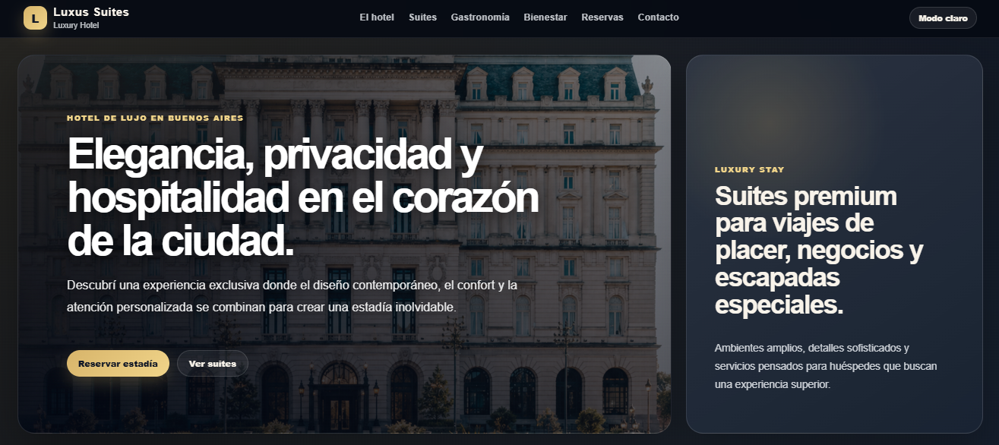
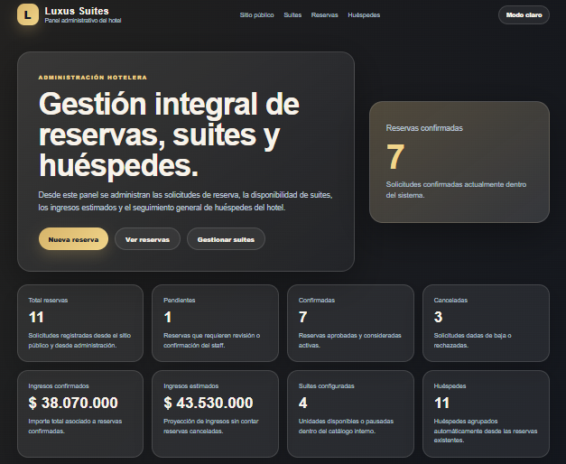
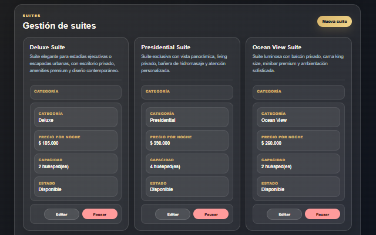
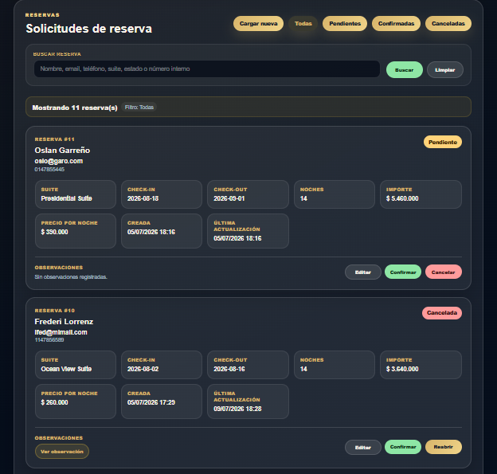
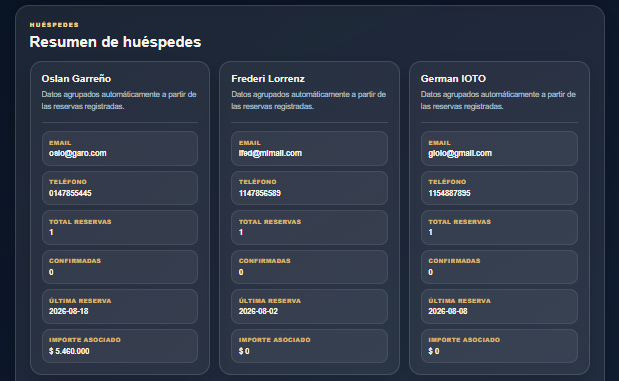
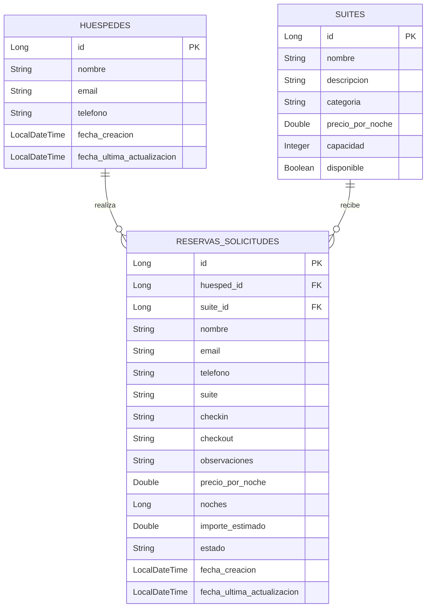

# Luxus Suites Management

Sistema web de gestión hotelera desarrollado con **Java 17**, **Spring Boot**, **Thymeleaf**, **Spring Data JPA**, **H2 Database** para desarrollo local y **PostgreSQL** para producción.

El proyecto permite administrar un hotel premium desde dos áreas diferenciadas:

- **Sitio público:** landing institucional orientada a clientes, presentación de suites, servicios y formulario de solicitud de reserva.
- **Panel administrativo:** gestión interna de suites, reservas, huéspedes, disponibilidad, estados e ingresos estimados.

---

## Índice

1. [Descripción general](#descripción-general)
2. [Capturas del proyecto](#capturas-del-proyecto)
3. [Objetivo del proyecto](#objetivo-del-proyecto)
4. [Tecnologías utilizadas](#tecnologías-utilizadas)
5. [Arquitectura general](#arquitectura-general)
6. [Funcionalidades principales](#funcionalidades-principales)
7. [Sitio público](#sitio-público)
8. [Panel administrativo](#panel-administrativo)
9. [Gestión de reservas](#gestión-de-reservas)
10. [Gestión de suites](#gestión-de-suites)
11. [Gestión de huéspedes](#gestión-de-huéspedes)
12. [Validaciones de negocio](#validaciones-de-negocio)
13. [Base de datos](#base-de-datos)
14. [DER del sistema](#der-del-sistema)
15. [Entidades principales](#entidades-principales)
16. [Estructura del proyecto](#estructura-del-proyecto)
17. [Cómo ejecutar el proyecto](#cómo-ejecutar-el-proyecto)
18. [Acceso a la aplicación](#acceso-a-la-aplicación)
19. [Acceso a H2 Console](#acceso-a-h2-console)
20. [Consultas útiles de base de datos](#consultas-útiles-de-base-de-datos)
21. [Configuración para producción](#configuración-para-producción)
22. [Modo claro y oscuro](#modo-claro-y-oscuro)
23. [Responsive design](#responsive-design)
24. [Decisiones técnicas](#decisiones-técnicas)
25. [Flujo básico de uso](#flujo-básico-de-uso)
26. [Estado actual](#estado-actual)
27. [Posibles mejoras futuras](#posibles-mejoras-futuras)
28. [Autor](#autor)
29. [Licencia](#licencia)

---

## Descripción general

**Luxus Suites Management** es una aplicación web orientada a la gestión de reservas para un hotel de lujo.

El sistema diferencia claramente la experiencia pública del cliente y la administración interna del hotel.

Desde el sitio público, el visitante puede conocer la propuesta del hotel, revisar suites y servicios, consultar información de contacto y enviar una solicitud de reserva. Desde el panel administrativo, el staff puede gestionar suites, reservas, huéspedes, disponibilidad, estados e ingresos asociados.

La aplicación fue desarrollada con una estructura por capas, utilizando Spring Boot para el backend, Thymeleaf para las vistas, JPA/Hibernate para la persistencia y una base de datos relacional.

---

## Capturas del proyecto

### Sitio público - Desktop



### Sitio público - Mobile


### Panel administrativo - Dashboard



### Gestión de suites



### Gestión de reservas



### Resumen de huéspedes



---

## Objetivo del proyecto

El objetivo principal del proyecto es construir una aplicación funcional, presentable y completa para la administración de reservas hoteleras.

El proyecto permite demostrar:

- Desarrollo web con Java y Spring Boot.
- Uso del patrón MVC.
- Renderizado de vistas con Thymeleaf.
- Persistencia con Spring Data JPA e Hibernate.
- Configuración de base de datos para desarrollo y producción.
- Manejo de formularios.
- Validaciones de negocio.
- Relaciones entre entidades.
- Gestión de reservas, suites y huéspedes.
- Diseño responsive.
- Organización del código por capas.
- Preparación para despliegue.

---

## Tecnologías utilizadas

| Tecnología | Uso dentro del proyecto |
|---|---|
| Java 17 | Lenguaje principal del backend |
| Spring Boot | Framework principal de la aplicación |
| Spring MVC | Manejo de rutas, controladores y formularios |
| Spring Data JPA | Persistencia de entidades |
| Hibernate | Implementación ORM utilizada por JPA |
| Thymeleaf | Motor de plantillas HTML del lado del servidor |
| H2 Database | Base local para desarrollo |
| PostgreSQL | Base relacional para producción |
| HTML5 | Estructura de vistas |
| CSS3 | Estilos, diseño visual y responsive |
| JavaScript | Carrusel, modal de observaciones y modo claro/oscuro |
| Maven Wrapper | Compilación y ejecución sin depender de Maven global |
| Git | Control de versiones |

---

## Arquitectura general

El proyecto utiliza una arquitectura por capas:

```text
Controller -> Service -> Repository -> Database
```

### Controller

Recibe las peticiones HTTP, coordina el flujo de navegación, prepara los datos para las vistas y redirige según corresponda.

Archivo principal:

```text
HomeController.java
```

### Service

Contiene la lógica de negocio del sistema:

- Validación de reservas.
- Cálculo de noches.
- Cálculo de importes.
- Control de reservas superpuestas.
- Creación o actualización de huéspedes.
- Gestión de suites.
- Gestión de estados de reserva.
- Armado del resumen administrativo de huéspedes.

Archivos principales:

```text
ReservaService.java
SuiteService.java
HuespedService.java
```

### Repository

Capa de acceso a datos mediante Spring Data JPA.

Archivos principales:

```text
ReservaSolicitudRepository.java
SuiteRepository.java
HuespedRepository.java
```

### Model

Contiene las entidades principales y clases auxiliares del dominio.

Archivos principales:

```text
ReservaSolicitud.java
Suite.java
Huesped.java
HuespedResumen.java
```

---

## Funcionalidades principales

### Sitio público

- Landing pública del hotel.
- Presentación institucional.
- Imagen principal del hotel.
- Sección de información rápida.
- Sección de alojamiento.
- Carrusel de suites.
- Imagen editorial de alojamiento.
- Sección de gastronomía.
- Imagen editorial de desayuno.
- Sección de bienestar y spa.
- Imagen editorial de spa.
- Sección de servicios.
- Formulario público de solicitud de reserva.
- Validación de datos de reserva.
- Página de confirmación de reserva.
- Preguntas frecuentes.
- Datos de contacto.
- Footer con acceso al panel administrativo.
- Modo claro y oscuro.
- Diseño responsive para desktop, tablet y mobile.

### Panel administrativo

- Dashboard inicial con métricas generales.
- Gestión de suites.
- Alta de nuevas suites.
- Edición de suites.
- Activación y pausa de suites.
- Gestión de reservas.
- Alta interna de reservas.
- Edición de reservas.
- Confirmación de reservas.
- Cancelación de reservas.
- Reapertura de reservas.
- Filtros por estado.
- Buscador de reservas.
- Modal para observaciones.
- Resumen de huéspedes.
- Panel responsive para mobile.

---

## Sitio público

El sitio público se encuentra en:

```text
https://luxus-suites-management.onrender.com/
```

Su finalidad es mostrar una experiencia visual similar a una web real de hotel premium.

### Secciones principales del sitio público

#### Hero principal

Presenta el hotel con una imagen institucional y textos orientados a la reserva.

Incluye llamados a la acción:

- Ver suites.
- Solicitar reserva.

#### Información rápida

Bloque de tarjetas con datos importantes:

- Check-in / Check-out.
- Categoría del hotel.
- Ubicación.
- Suites.

#### Alojamiento

Sección dedicada a la presentación de las suites y la experiencia de descanso.

Incluye:

- Imagen editorial.
- Card informativa sobre imagen.
- Carrusel de suites.

#### Gastronomía

Presenta la propuesta gastronómica del hotel.

Incluye:

- Imagen de desayuno.
- Card informativa sobre imagen.
- Beneficios destacados.

#### Bienestar

Presenta los servicios de relax, spa y confort.

Incluye:

- Imagen de spa.
- Card informativa sobre imagen.
- Tarjetas de servicios.

#### Reservas

Formulario público para solicitar una reserva.

Campos:

- Nombre.
- Email.
- Teléfono.
- Suite.
- Check-in.
- Check-out.
- Observaciones.

#### Preguntas frecuentes

Bloque de consultas frecuentes antes de reservar.

#### Contacto

Datos de contacto del hotel:

- Dirección.
- Email de reservas.
- Teléfono.
- Horario de atención.

---

## Panel administrativo

El panel administrativo se encuentra en:

```text
http://localhost:8081/admin
```

El menú actual del panel incluye:

```text
Sitio público
Suites
Reservas
Huéspedes
```

El dashboard se muestra al ingresar al panel, por eso no se mantiene como pestaña independiente.

---

## Dashboard administrativo

El dashboard inicial muestra un resumen general del estado del hotel.

Métricas disponibles:

- Total de reservas.
- Reservas pendientes.
- Reservas confirmadas.
- Reservas canceladas.
- Ingresos confirmados.
- Ingresos estimados.
- Suites configuradas.
- Huéspedes agrupados.

También incluye accesos rápidos a:

- Nueva reserva.
- Ver reservas.
- Gestionar suites.

---

## Gestión de reservas

Las reservas se gestionan desde la sección:

```text
/admin#solicitudes
```

Cada reserva contiene:

| Campo | Descripción |
|---|---|
| ID interno | Número automático generado por la base |
| Huésped | Relación con la entidad Huesped |
| Suite | Relación con la entidad Suite |
| Nombre | Snapshot del nombre del huésped |
| Email | Snapshot del email del huésped |
| Teléfono | Snapshot del teléfono del huésped |
| Nombre de suite | Snapshot del nombre de la suite |
| Check-in | Fecha de ingreso |
| Check-out | Fecha de egreso |
| Noches | Cantidad calculada automáticamente |
| Precio por noche | Precio de la suite al momento de la reserva |
| Importe estimado | Precio por noche multiplicado por noches |
| Observaciones | Comentarios adicionales del huésped o staff |
| Estado | Pendiente, Confirmada o Cancelada |
| Fecha de creación | Fecha en que se registró la solicitud |
| Última actualización | Fecha de última modificación o cambio de estado |

### Estados de una reserva

| Estado | Significado |
|---|---|
| Pendiente | La reserva fue cargada y espera revisión |
| Confirmada | La reserva fue aprobada por el staff |
| Cancelada | La reserva fue rechazada o dada de baja |

### Acciones disponibles

Desde el panel se puede:

- Editar una reserva.
- Confirmar una reserva.
- Cancelar una reserva.
- Reabrir una reserva.
- Ver observaciones en un modal.
- Buscar por nombre, email, teléfono, suite, estado o número interno.
- Filtrar por estado.

---

## Gestión de suites

Las suites se gestionan desde:

```text
/admin#suites-admin
```

Cada suite contiene:

| Campo | Descripción |
|---|---|
| ID | Identificador automático |
| Nombre | Nombre comercial de la suite |
| Descripción | Descripción visible y administrativa |
| Categoría | Categoría o tipo de suite |
| Precio por noche | Valor usado para calcular importes |
| Capacidad | Cantidad de huéspedes |
| Disponibilidad | Activa o pausada |

### Acciones disponibles

Desde el panel se puede:

- Crear una suite.
- Editar una suite.
- Activar una suite.
- Pausar una suite.

Las suites pausadas no aparecen como opción disponible para nuevas reservas públicas o internas.

---

## Gestión de huéspedes

La sección de huéspedes se encuentra en:

```text
/admin#huespedes-admin
```

El sistema cuenta con una entidad real de huéspedes. Al registrar una reserva, el sistema busca el huésped por email. Si ya existe, actualiza sus datos principales. Si no existe, crea un nuevo registro.

Además, el panel muestra un resumen administrativo generado a partir de las reservas asociadas.

Para cada huésped se muestra:

| Campo | Descripción |
|---|---|
| Nombre | Nombre del huésped |
| Email | Email registrado |
| Teléfono | Teléfono registrado |
| Total de reservas | Cantidad total de reservas asociadas |
| Confirmadas | Cantidad de reservas confirmadas |
| Última reserva | Fecha de check-in más reciente |
| Importe asociado | Suma de importes no cancelados |

---

## Validaciones de negocio

El sistema incluye validaciones tanto en reservas como en suites.

### Validaciones de reservas

Se valida que:

- El nombre sea obligatorio.
- El email sea obligatorio.
- El email tenga formato válido.
- El teléfono sea obligatorio.
- El check-in sea obligatorio.
- El check-out sea obligatorio.
- El check-out sea posterior al check-in.
- La suite seleccionada exista.
- La suite seleccionada esté disponible.
- No exista otra reserva confirmada superpuesta para la misma suite.

### Validación de reservas superpuestas

Una reserva se considera superpuesta cuando:

```text
nuevoCheckin < checkoutExistente
nuevoCheckout > checkinExistente
```

Esto evita confirmar o registrar una reserva si ya existe una reserva confirmada para la misma suite en fechas coincidentes.

### Validaciones de suites

Se valida que:

- El nombre de la suite sea obligatorio.
- La categoría sea obligatoria.
- La descripción sea obligatoria.
- El precio por noche sea mayor a cero.
- La capacidad sea mayor a cero.

---

## Base de datos

El proyecto está configurado con perfiles de entorno:

| Perfil | Base de datos | Uso |
|---|---|---|
| dev | H2 Database | Desarrollo local |
| prod | PostgreSQL | Producción |

El perfil por defecto es `dev`.

Archivo principal:

```properties
spring.application.name=luxus-suites-management
spring.profiles.active=${SPRING_PROFILES_ACTIVE:dev}
```

### Configuración local con H2

Archivo:

```text
src/main/resources/application-dev.properties
```

Configuración:

```properties
server.port=8081

spring.datasource.url=jdbc:h2:file:./data/luxusdb;DB_CLOSE_ON_EXIT=FALSE
spring.datasource.driver-class-name=org.h2.Driver
spring.datasource.username=sa
spring.datasource.password=

spring.h2.console.enabled=true
spring.h2.console.path=/h2-console

spring.jpa.hibernate.ddl-auto=update
spring.jpa.show-sql=true
spring.jpa.properties.hibernate.format_sql=true
spring.jpa.open-in-view=false
```

La base local se guarda en:

```text
data/
```

La carpeta `data/` debe permanecer fuera del repositorio, por eso se incluye en `.gitignore`.

### Configuración de producción con PostgreSQL

Archivo:

```text
src/main/resources/application-prod.properties
```

Configuración:

```properties
server.port=${PORT:8080}

spring.datasource.url=jdbc:postgresql://${PGHOST}:${PGPORT}/${PGDATABASE}
spring.datasource.driver-class-name=org.postgresql.Driver
spring.datasource.username=${PGUSER}
spring.datasource.password=${PGPASSWORD}

spring.jpa.hibernate.ddl-auto=update
spring.jpa.show-sql=false
spring.jpa.properties.hibernate.format_sql=false
spring.jpa.open-in-view=false

spring.h2.console.enabled=false
```

---

## DER del sistema

El modelo actual utiliza relaciones reales entre huéspedes, suites y reservas.



Relaciones:

```text
HUESPEDES 1 -> N RESERVAS_SOLICITUDES
SUITES    1 -> N RESERVAS_SOLICITUDES
```

Una reserva pertenece a un huésped y a una suite. Un huésped puede tener muchas reservas. Una suite puede recibir muchas reservas en distintas fechas.

---

## Entidades principales

### Huesped

Representa un huésped real dentro del sistema.

Campos principales:

```text
id
nombre
email
telefono
fechaCreacion
fechaUltimaActualizacion
```

### Suite

Representa una suite del hotel.

Campos principales:

```text
id
nombre
descripcion
categoria
precioPorNoche
capacidad
disponible
```

### ReservaSolicitud

Representa una solicitud o reserva dentro del sistema.

Campos principales:

```text
id
huesped
suiteEntidad
nombre
email
telefono
suiteNombre
checkin
checkout
observaciones
precioPorNoche
noches
importeEstimado
estado
fechaCreacion
fechaUltimaActualizacion
```

### HuespedResumen

No es una entidad persistida. Es una clase auxiliar usada para mostrar información agrupada de huéspedes en el panel administrativo.

Campos principales:

```text
nombre
email
telefono
totalReservas
reservasConfirmadas
importeAsociado
ultimaReserva
```

---

## Estructura del proyecto

```text
luxus-suites-management
│
├── pom.xml
├── mvnw
├── mvnw.cmd
├── README.md
│
├── docs
│   └── screenshots
│       ├── home-desktop.png
│       ├── home-mobile.png
│       ├── admin-dashboard.png
│       ├── admin-suites.png
│       ├── admin-reservas.png
│       └── admin-huespedes.png
│
├── data/                         # Base H2 local, no versionada
│
└── src
    └── main
        ├── java
        │   └── com
        │       └── luxus
        │           └── suites
        │               ├── LuxusSuitesManagementApplication.java
        │               │
        │               ├── controller
        │               │   └── HomeController.java
        │               │
        │               ├── model
        │               │   ├── Huesped.java
        │               │   ├── HuespedResumen.java
        │               │   ├── ReservaSolicitud.java
        │               │   └── Suite.java
        │               │
        │               ├── repository
        │               │   ├── HuespedRepository.java
        │               │   ├── ReservaSolicitudRepository.java
        │               │   └── SuiteRepository.java
        │               │
        │               └── service
        │                   ├── HuespedService.java
        │                   ├── ReservaService.java
        │                   └── SuiteService.java
        │
        └── resources
            ├── application.properties
            ├── application-dev.properties
            ├── application-prod.properties
            │
            ├── static
            │   ├── css
            │   │   └── styles.css
            │   │
            │   ├── img
            │   │   ├── luxus.png
            │   │   ├── suite.png
            │   │   ├── breakfast.png
            │   │   └── spa1.png
            │   │
            │   └── js
            │       └── theme.js
            │
            └── templates
                ├── index.html
                ├── admin.html
                ├── reserva-confirmacion.html
                ├── reserva-editar.html
                ├── reserva-nueva-admin.html
                ├── suite-editar.html
                └── suite-nueva.html
```

---

## Cómo ejecutar el proyecto

### Requisitos previos

Es necesario tener instalado o configurado:

- Java 17.
- Git.
- Navegador web.
- IntelliJ IDEA, VS Code u otro IDE compatible.

No es necesario tener Maven instalado globalmente porque el proyecto usa **Maven Wrapper**.

### 1. Clonar el repositorio

```bash
git clone URL_DEL_REPOSITORIO
```

### 2. Ingresar a la carpeta del proyecto

```bash
cd luxus-suites-management
```

### 3. Verificar Java

```bash
java -version
```

Debe mostrarse una versión de Java 17.

### 4. Configurar JAVA_HOME en Windows si fuera necesario

Si aparece un error como:

```text
The JAVA_HOME environment variable is not defined correctly
```

configurar temporalmente en la terminal:

```cmd
set JAVA_HOME=C:\Users\Federico\.jdks\temurin-17.0.19
set PATH=%JAVA_HOME%\bin;%PATH%
```

Luego verificar:

```cmd
java -version
```

### 5. Compilar

En Windows:

```cmd
mvnw.cmd clean compile
```

En Linux/macOS:

```bash
./mvnw clean compile
```

Resultado esperado:

```text
BUILD SUCCESS
```

### 6. Ejecutar en modo desarrollo

En Windows:

```cmd
mvnw.cmd spring-boot:run
```

En Linux/macOS:

```bash
./mvnw spring-boot:run
```

Cuando la aplicación inicia correctamente se puede ver un mensaje similar a:

```text
Started LuxusSuitesManagementApplication
```

---

## Acceso a la aplicación

Sitio público:

```text
http://localhost:8081/
```

Panel administrativo:

```text
http://localhost:8081/admin
```

Consola H2:

```text
http://localhost:8081/h2-console
```

---

## Acceso a H2 Console

Datos de conexión:

```text
JDBC URL: jdbc:h2:file:./data/luxusdb
User Name: sa
Password: dejar vacío
```

Luego presionar **Connect**.

---

## Consultas útiles de base de datos

Ver reservas:

```sql
SELECT * FROM RESERVAS_SOLICITUDES;
```

Ver suites:

```sql
SELECT * FROM SUITES;
```

Ver huéspedes:

```sql
SELECT * FROM HUESPEDES;
```

Ver reservas confirmadas:

```sql
SELECT * FROM RESERVAS_SOLICITUDES
WHERE ESTADO = 'Confirmada';
```

Ver reservas pendientes:

```sql
SELECT * FROM RESERVAS_SOLICITUDES
WHERE ESTADO = 'Pendiente';
```

Ver suites disponibles:

```sql
SELECT * FROM SUITES
WHERE DISPONIBLE = TRUE;
```

Ver reservas con datos relacionados:

```sql
SELECT
    r.ID,
    h.NOMBRE AS HUESPED,
    h.EMAIL,
    s.NOMBRE AS SUITE,
    r.CHECKIN,
    r.CHECKOUT,
    r.NOCHES,
    r.IMPORTE_ESTIMADO,
    r.ESTADO
FROM RESERVAS_SOLICITUDES r
LEFT JOIN HUESPEDES h ON r.HUESPED_ID = h.ID
LEFT JOIN SUITES s ON r.SUITE_ID = s.ID;
```

---

## Configuración para producción

El proyecto está preparado para utilizar PostgreSQL en producción mediante el perfil `prod`.

Variables esperadas:

```text
SPRING_PROFILES_ACTIVE=prod
PORT
PGHOST
PGPORT
PGDATABASE
PGUSER
PGPASSWORD
```

La aplicación construye la conexión JDBC con:

```properties
spring.datasource.url=jdbc:postgresql://${PGHOST}:${PGPORT}/${PGDATABASE}
```

Para producción se desactiva la consola H2:

```properties
spring.h2.console.enabled=false
```

---

## Modo claro y oscuro

El proyecto incluye alternancia entre modo oscuro y modo claro.

El botón de cambio de tema está disponible en:

- Sitio público.
- Panel administrativo.

El manejo se realiza desde:

```text
src/main/resources/static/js/theme.js
```

El estado visual se aplica mediante clases CSS.

---

## Responsive design

El proyecto fue ajustado para distintos tamaños de pantalla:

| Tamaño | Estado |
|---|---|
| Desktop | Optimizado |
| Notebook | Optimizado |
| Tablet | Optimizado |
| Mobile 320px | Optimizado |

Se ajustaron especialmente:

- Landing pública.
- Carrusel de suites.
- Cards internas.
- Imágenes editoriales.
- Captions sobre imágenes.
- Formulario de reserva.
- Contacto.
- Preguntas frecuentes.
- Panel administrativo mobile.
- Botones de acciones.
- Cards de reservas.
- Cards de suites.
- Resumen de huéspedes.

---

## Decisiones técnicas

### Perfiles de configuración

El proyecto usa perfiles separados para desarrollo y producción.

- `dev`: H2 Database local.
- `prod`: PostgreSQL.

Esto permite trabajar localmente sin depender de un servicio externo y preparar el proyecto para despliegue con una base relacional de producción.

### Uso de H2 en desarrollo

H2 se utiliza en archivo local para facilitar pruebas y persistencia durante el desarrollo.

### Uso de PostgreSQL en producción

PostgreSQL se utiliza como base relacional para producción, permitiendo persistencia externa y una configuración más adecuada para un entorno desplegado.

### Uso de Thymeleaf

Thymeleaf permite renderizar vistas HTML desde el servidor y trabajar de forma directa con los modelos enviados desde Spring MVC.

### Uso de JPA

JPA permite persistir las entidades principales sin escribir SQL manual para las operaciones básicas.

### Modelo normalizado

El modelo cuenta con relaciones reales entre:

```text
Huesped
Suite
ReservaSolicitud
```

Una reserva pertenece a un huésped y a una suite.

### Snapshots de datos en reserva

La reserva conserva datos de respaldo como nombre, email, teléfono y nombre de suite. Esto permite mantener datos históricos aunque luego se actualicen los datos principales del huésped o de la suite.

### Validación de superposición

La validación de reservas superpuestas se realiza en la capa de servicio para mantener la lógica de negocio centralizada.

### CSS central

El proyecto utiliza un único archivo CSS central:

```text
src/main/resources/static/css/styles.css
```

El archivo está organizado por secciones comentadas para facilitar mantenimiento.

---

## Flujo básico de uso

### Flujo público

1. El visitante ingresa al sitio.
2. Revisa suites y servicios.
3. Completa el formulario de reserva.
4. El sistema valida los datos.
5. El sistema crea o actualiza el huésped.
6. El sistema registra una solicitud pendiente.
7. Se muestra una confirmación.

### Flujo administrativo

1. El staff ingresa al panel.
2. Revisa métricas del dashboard.
3. Gestiona suites disponibles.
4. Revisa solicitudes de reserva.
5. Confirma, cancela, reabre o edita reservas.
6. Consulta el resumen de huéspedes.

---

## Estado actual

El proyecto se encuentra en una versión funcional que incluye:

- Sitio público completo.
- Panel administrativo operativo.
- Persistencia local con H2.
- Configuración para producción con PostgreSQL.
- Gestión de suites.
- Gestión de reservas.
- Gestión de huéspedes.
- Gestión de estados.
- Validaciones principales.
- Control de superposición de reservas.
- Relaciones reales entre entidades.
- Modo claro y oscuro.
- Responsive para desktop, tablet y mobile.
- CSS central organizado y comentado.
- README con capturas y DER.

---

## Posibles mejoras futuras

Algunas mejoras posibles para futuras versiones:

- Login para proteger el panel administrativo.
- Roles de usuario.
- Historial detallado de cambios de estado.
- Confirmación por email.
- Exportación de reservas a PDF o Excel.
- Calendario visual de ocupación.
- Gestión de pagos.
- Filtros avanzados por fecha.
- Reportes mensuales.
- Dashboard con gráficos.
- Tests automatizados de servicios y controladores.
- Deploy en entorno productivo.
- Migraciones de base de datos con Flyway o Liquibase.
- Perfil de administrador con credenciales.

---

## Notas de desarrollo

Durante el desarrollo se trabajó especialmente en:

- Separar la experiencia pública de la experiencia administrativa.
- Mantener una apariencia de hotel real.
- Mejorar el responsive mobile.
- Mantener un único CSS central, ordenado y comentado.
- Normalizar el modelo de datos.
- Preparar configuración para desarrollo y producción.
- Guardar cambios en commits progresivos.

---

## Autor

Proyecto desarrollado por:

**Leandro Federico Sosa**

---

## Licencia

Proyecto desarrollado con fin profesional.
